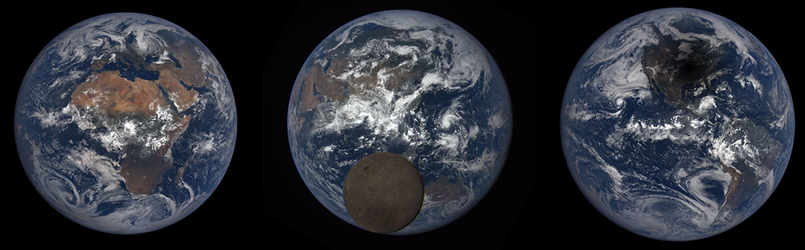
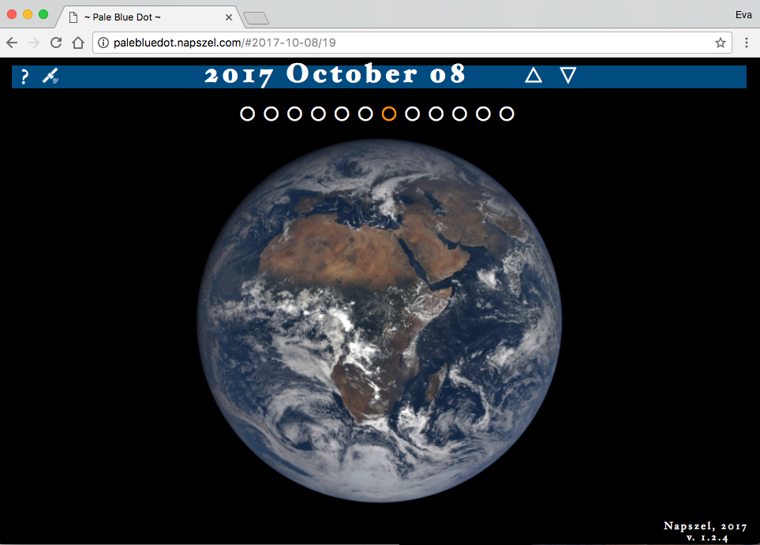
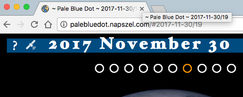
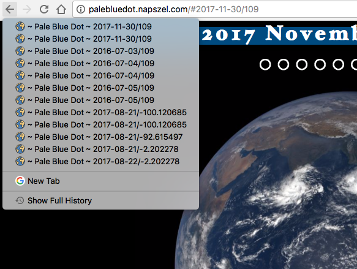
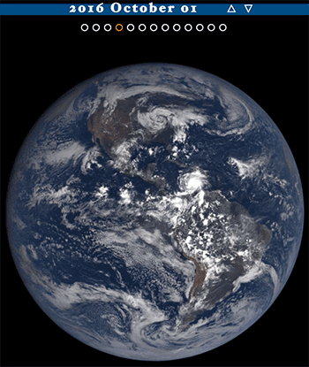

# Pale Blue Dot the NASA Datanauts project
##### [palebluedot.napszel.com](palebluedot.napszel.com)



_Look again at that dot. That's here. That's home. That's us. On it everyone you love, everyone you know, everyone you ever heard of, every human being who ever was, lived out their lives. ... -on a mote of dust suspended in a sunbeam._

-- Carl Sagan, Pale Blue Dot, 1994

### NASA Datanauts

[NASA Datanauts](https://open.nasa.gov/explore/datanauts/) is a community of volunteer data scientists who work with [NASA's open data](https://open.nasa.gov/open-data/) to solve data challenges and to create new processes and products. Every half a year the Datanauts founding class welcomes 50 newcomers to join the community to advance their data science skills. Datanauts engage with each other and subject matter experts, listen to presentations, learn by completing challenges and work on their projects.
 
I joined Datanauts as a member of the [2017 Spring Class](https://open.nasa.gov/explore/datanauts/2017/spring/). As my project I decided to work with the images taken by NASA's [Earth Polychromatic Imaging Camera](https://epic.gsfc.nasa.gov/epic) (EPIC).

This camera takes multiple colored images of the entire sunlit face of Earth every day. The spacecraft is located at the Earth-Sun Lagrange-1 (L-1) point giving EPIC a unique angular perspective. It has a field of view of 0.62 degrees, which is sufficient to image the entire Earth and its distance from our planet, also allows it to captures Moon transits.

### The Pale Blue Dot project

The goal of [Pale Blue Dot](http://palebluedot.napszel.com) was to create a web page (mobile compatible) where the hundreds of images taken by EPIC can be viewed in an intuitive and enjoyable way. Which means no user interface clutter (no buttons needed to navigate), very responsive experience (minimal waiting time if any) and showing the images as big as possible to let the user get "lost" in what is important: the astonishing images of our planet.



### The JavaScript UX/UI

The first version of the project was pure Javascript that directly talked to NASA's servers. At this stage the focus was on perfecting the User Experience. Even though at first it sounds like a simple enough project, surprisingly many things had to be considered and implemented:
 
 1. _CSS media query_
 Making it mobile friendly
 2. _Rotate with mouse drag/swipe, Change date with mouse scroll/swipe_
 3. _URL handling_: 
 format #date/longitude, edit (different types of dates), copy paste, only date, only longitude, replace url but only after a while
 4. _Preserving selected longitude_: 
 only usa images on solar eclipse, if user scrolls there from europe, stays at europe
 5. _Back/Forward navigation_:
 6. _History_:
 Editing the title of the page.
  
  
   
### The EPIC NASA server

After the User Interface is ready and the navigation is intuitive, comes the question of speed. An interactive UI that is enjoyable responds to every user action within a second (if there is _any_ way possible). Even if the implementation gives a simple way to change dates - mouse scroll -, if the new image takes 3-5 seconds to load, it will quickly board the user and hinder the positive experience. 

_Especially_, if the UI gives options to change views very quickly, the site has to be responsive. If the users were to change date with a date selector, they might be more forgiving in waiting time. However, one of goals of the project was to awe the users with these beautiful, cloudy Earth images swirling in front of their eyes, so waiting time was not something I wanted to compromise on.



NASA stores these images on the server epic.gsfc.nasa.gov which accepts requests through an open API. To find out the available images (names and many other information) for a given day, you can request a JSON file. This means you have to download one JSON file to show the images of one day. For example part of the JSON file for 2015-10-31:

```json
[  
   {  
      "identifier":"20151031003633",
      "caption":"This image was taken by NASA's EPIC camera onboard the NOAA DSCOVR spacecraft",
    * "image":"epic_RGB_20151031003633",
      "version":"01",
      "centroid_coordinates":{  
         "lat":-5.102852,
         "lon":159.542508
      },
      "dscovr_j2000_position":{  
         "x":-1283061.502946,
         "y":-669893.465826,
         "z":-130240.863464
      },
      "lunar_j2000_position":{  
         "x":33466.895832,
         "y":354549.449169,
         "z":116876.96183
      },
      "sun_j2000_position":{  
         "x":-118557507.99999,
         "y":-82106194.000015,
         "z":-35593694.71975
      },
      "attitude_quaternions":{  
         "q0":-0.308502,
         "q1":-0.119342,
         "q2":0.210556,
         "q3":0.919914
      },
    * "date":"2015-10-31 00:31:45",
      "coords":{  
        "centroid_coordinates":{  
            "lat":-5.102852,
    *       "lon":159.542508
         },
         "dscovr_j2000_position":{  
            "x":-1283061.502946,
            "y":-669893.465826,
            "z":-130240.863464
         },
         "lunar_j2000_position":{  
            "x":33466.895832,
            "y":354549.449169,
            "z":116876.96183
         },
         "sun_j2000_position":{  
            "x":-118557507.99999,
            "y":-82106194.000015,
            "z":-35593694.71975
         },
         "attitude_quaternions":{  
            "q0":-0.308502,
            "q1":-0.119342,
            "q2":0.210556,
            "q3":0.919914
         }
      }
   },
   ...
]
```

This extract shows the information for _one image_ of the given date. The camera might take as many as 22 images per day. A full JSON file for such day is around 22 kilobytes which takes around 1 second to download on fast internet and up to 3 seconds on slower one in Europe (results should be better closer to the USA server and worse in Asia). And this is _only the JSON file_. We are not talking about downloading the images themselves.


### Serving the JSON files

The JSON files provided by NASA contained too many unnecessary information for my project and is serviced too slow for the UX I had in mind. See in the previous file example - marked with asterisks - the 3 data that I actually need for one image: name, longitude (in which direction Earth is rotated on the image) and date. To improve this, the JSON files were compacted and serviced from our own server. 

To shrink the JSON files the images are grouped together by date. This way only a list of name-longitude pairs are left. If we also group together the _days_ in one singe JSON file we get this format:

```
[  
   {
      "d":"2015-10-12",
      "n":21,
      "i":[  
         "epic_1b_20151012000830",
         "epic_1b_20151012011358",
         "epic_1b_20151012032454",
         "epic_1b_20151012043021",
         "epic_1b_20151012053549",
         "epic_1b_20151012064118",
         "epic_1b_20151012074645",
         "epic_1b_20151012085213",
         "epic_1b_20151012095741",
         "epic_1b_20151012110308",
         "epic_1b_20151012120836",
         "epic_1b_20151012131404",
         "epic_1b_20151012141932",
         "epic_1b_20151012152459",
         "epic_1b_20151012163027",
         "epic_1b_20151012173555",
         "epic_1b_20151012184122",
         "epic_1b_20151012205219",
         "epic_1b_20151012215747",
         "epic_1b_20151012230314",
         "epic_1b_20151012021926"
      ],
      "l":[  
         166.151121,
         149.782218,
         117.048651,
         100.679819,
         84.31101,
         67.942223,
         51.577625,
         35.208885,
         18.840167,
         2.47147,
         -13.893037,
         -30.261688,
         -46.630318,
         -62.998926,
         -79.363345,
         -95.731908,
         -112.10045,
         -144.837471,
         -161.205948,
         -177.570236,
         133.41334
      ]
   },
   ...
]
```
 
This extract shows the information for _one day_ with 21 images. The rest of the days would follow after.

To serve such JSON file from our server the following scripts implemented:
 
 1. A Bash script that downloads recent JSON files from NASA server.
 2. A Python script that sorts each daily JSON file based on coordinates.
 3. A Python script that concatenates the sorted daily JSON files into one single JSON file sorted by date (in the format shown above).
 4. A Bash script that runs all of the above in order.
 5. And finally a cronjob that runs the previous Bash script daily.
   
At the time of writing this document the full JSON file with all the days concatenated together from the beginning of EPIC's life is 418 kilobytes. This single file is enough to be downloaded once - right at page load - and serves every later data request in an instant.

### Serving the images

- 2048 x2048 too big
- CDN push zone

### Image size magic

### Error reporting - TrackJS

### Performance reporting - TrakErr

### Future development
Better compact JSON

#### Feedback

eva@napszel.com

