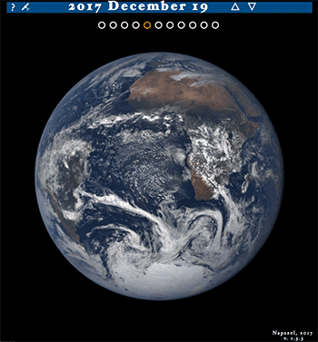
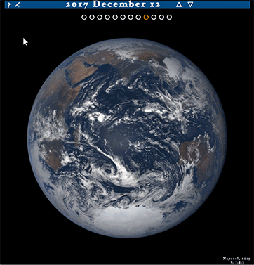
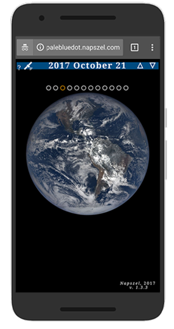

# Pale Blue Dot the NASA Datanauts project
### [palebluedot.napszel.com](palebluedot.napszel.com)


_Look again at that dot. That's here. That's home. That's us. On it everyone you love, everyone you know, everyone you ever heard of, every human being who ever was, lived out their lives. ... -on a mote of dust suspended in a sunbeam._

-- Carl Sagan, Pale Blue Dot, 1994

### NASA Datanauts

[NASA Datanauts](https://open.nasa.gov/explore/datanauts/) is a community of volunteer data scientists who work with [NASA's open data](https://open.nasa.gov/open-data/) to solve data challenges and to create new processes and products. Every half a year the Datanauts founding class welcomes 50 newcomers to join the community to advance their data science skills. Datanauts engage with each other and subject matter experts, listen to presentations, learn by completing challenges and work on their projects.
 
I joined Datanauts as a member of the [2017 Spring Class](https://open.nasa.gov/explore/datanauts/2017/spring/). As my project I decided to work with the images taken by NASA's [Earth Polychromatic Imaging Camera](https://epic.gsfc.nasa.gov/epic) (EPIC).

This camera takes multiple colored images of the entire sunlit face of Earth every day. The spacecraft is located at the Earth-Sun Lagrange-1 (L-1) point giving EPIC a unique angular perspective. It has a field of view of 0.62 degrees, which is sufficient to image the entire Earth. Its distance from our planet, also allows it to captures Moon transits.

### The Pale Blue Dot project

The goal of [Pale Blue Dot](http://palebluedot.napszel.com) was to create a web page (mobile compatible) where the hundreds of images taken by EPIC can be viewed in an intuitive and enjoyable way. Which means that there is no user interface clutter (no buttons needed to navigate), very responsive experience (minimal waiting time if any) and showing the images as big as possible to let the user get "lost" in what is important: the astonishing images of our planet.


### The JavaScript UX/UI

The first version of the project was pure Javascript that directly talked to NASA's servers. At this stage the focus was on perfecting the User Experience. Even though at first it sounds like a simple enough project, surprisingly many things had to be considered and implemented:
 
 1. **Navigation**
 
 Instead of buttons and sliders you can scroll with your mouse (or touchpad) to go back in time and load older images. To rotate Earth you can naturally click and drag it. Similarly on mobile: use finger swipe up/down and left/right to change date and rotate Earth.
 
 Additionally, discrete UI buttons (dots and arrows) are also available for precise navigation.
 
    
 
 The UI allows both fast and slow navigation: a small scroll/swipe or arrow click changes the date just by one day. A fast scroll/swipe will instantly update the date label to show the currently selected time. However, images will only start downloading after you view a date for longer than 500 ms. Also, full resolution images are loaded into the same object, which means that if you navigate away from a date before the image has been loaded the not any more needed request is cancelled and the newly requested image download is started instead.
 
 This means that loading a day from a year before will not result in a longer waiting time than loading yesterday's images.
 
 
 2. **URL handling**
 
 The Website's URL have the format _palebluedot.napszel.com/#2017-06-06/29_. That is: a hashmark followed by a date (separated by dashes) followed by a slash and a longitude number. Navigating to this URL will display an Earth image taken on 2017 June 6th showing Europe/Africa (longitude 29). You may copy-paste such paths for sharing.
 
 You are also free to edit the URLs to achieve fast and precise navigation. The application will search for the images taken on the supplied date (or if there no images on that day then the closest earlier date when images were taken). Then it will search for the Earth rotation that is closest to the supplied longitude.
 
 You may also enter only a date (_palebluedot.napszel.com/#2017-12-19_) or only a longitude (_palebluedot.napszel.com/#29_). In that case the other will take a default value ('today' for date and '29' for longitude). If neither is given (_palebluedot.napszel.com_) then both takes the default value which results in the latest image of Europe/Africa.
 
 3. **Browser's Back and Forward buttons**
 
 The application does not load different resources when navigating between days and Earth longitudes. The address does not change in the address bar only fragment identifiers are added after the hashmark. This means that the browser's Back and Forward button does not do anything by default. For them to work, the application has to manually push addresses to the browser's history.
 
 For example, in case you go back one day in time, the application will edit the date part of the path and push it to history. Now if you click the browser's Back button, you are taken back to today.
 
 But not all navigation results in a path editing. Consider the case where you scroll back 10 days very quickly with a mouse scroll or finger swipe. In this case if the path was edited to all dates during the scroll the browser's history would be polluted with day references which you did not really have the time to look at. To circumvent this, the path is only updated and pushed to history after you spend at least 500 ms viewing a day.
 
 4. **History**
 
 If you look at the history of your page visits in your browser, you can see that only the _title_ of each page is shown. In order to have meaningful history items for Pale Blue Dot the page's title is always edited according to the date/longitude selected. This way, instead of seeing ~ Pale Blue Dot ~, ~ Pale Blue Dot ~, ~ Pale Blue Dot ~ you see meaningful results.
 
 
  
 5. **Preserving selected longitude**
 
 Scrolling up and down between days preserves the longitude setting. This means that if you are viewing the European continent and then navigate to previous days, the application will always select the images closest to the European continent in previous days also. 
 
 But what if there are no close matches? For example on the day of the August 21st 2017 solar eclipse, multiple images were taken of the American continent to capture the event but none of Europe. If you are viewing an image of Europe from 22nd August and scroll to 21st of August the application will "jump" to the American continent. This is inevitable. However, if you continue to 20st of August you will see Europe again.
  
 This is achieved by making sure that the longitude part of the URL is _not_ updated in case of date changes. The longitude number seen in the path is a "goal" longitude. Meaning that the image shown by the app is the closest image to that longitude. But the opposite is not true: the longitude in the path is not necessarily the longitude number that the image represents.
 
 Longitudes are only updated by the app in case the user _rotates_ the earth with click and drag or finger swipe left/right.
 
 6. **CSS media query**
 
 Mobile screens are naturally smaller and required a slightly different UI arrangement to fit everything on screen. CSS media queries were used to change the layout for any screen below 670px.
 
  
   
### The EPIC NASA server

After the User Interface is ready and the navigation is intuitive, comes the question of _speed_. An interactive UI that is enjoyable responds to every user action within a second (if there is any way possible). Even if the implementation gives a simple way to change dates, if the new image takes 3-5 seconds to load, it will quickly board the user and hinder a positive experience. 

_Especially_, if the UI gives options to change views very quickly, the site has to be responsive. If the users were to change date with a date selector, they might be more forgiving in waiting time. However, one of goals of the project was to awe the users with these beautiful, cloudy Earth images swirling, so waiting time was not something I wanted to compromise on.


NASA stores these images on the server _epic.gsfc.nasa.gov_ which accepts requests through an open API. To find out the available images (names and many other information) for a given day, you can request a JSON file. This means you have to download one JSON file to show the images of one day. For example part of the JSON file for 2015-10-31:

```
[  
   {  
      "identifier":"20151031003633",
      "caption":"This image was taken by NASA's EPIC camera onboard the NOAA DSCOVR spacecraft",
    * "image":"epic_RGB_20151031003633",
      "version":"01",
      "centroid_coordinates":{  
         "lat":-5.102852,
         "lon":159.542508
      },
      "dscovr_j2000_position":{  
         "x":-1283061.502946,
         "y":-669893.465826,
         "z":-130240.863464
      },
      "lunar_j2000_position":{  
         "x":33466.895832,
         "y":354549.449169,
         "z":116876.96183
      },
      "sun_j2000_position":{  
         "x":-118557507.99999,
         "y":-82106194.000015,
         "z":-35593694.71975
      },
      "attitude_quaternions":{  
         "q0":-0.308502,
         "q1":-0.119342,
         "q2":0.210556,
         "q3":0.919914
      },
    * "date":"2015-10-31 00:31:45",
      "coords":{  
        "centroid_coordinates":{  
            "lat":-5.102852,
    *       "lon":159.542508
         },
         "dscovr_j2000_position":{  
            "x":-1283061.502946,
            "y":-669893.465826,
            "z":-130240.863464
         },
         "lunar_j2000_position":{  
            "x":33466.895832,
            "y":354549.449169,
            "z":116876.96183
         },
         "sun_j2000_position":{  
            "x":-118557507.99999,
            "y":-82106194.000015,
            "z":-35593694.71975
         },
         "attitude_quaternions":{  
            "q0":-0.308502,
            "q1":-0.119342,
            "q2":0.210556,
            "q3":0.919914
         }
      }
   },
   ...
]
```

This extract shows the information for _one image_ of the given date. The camera might take as many as 22 images per day. A full JSON file for such day is around 22 kilobytes which takes around 1 second to download on fast internet and up to 3 seconds on slower one in Europe (results should be better closer to the server in USA and worse in Asia). And this is _only the JSON file_. We are not yet talking about downloading the images themselves.


### Serving the JSON files

The JSON files provided by NASA contained too many unnecessary information for my project and is serviced too slow for the UX I had in mind. See in the previous file example - marked with asterisks - the 3 data that I actually need for one image: name, longitude and date. 

To improve on speed the JSON files were compacted and serviced from our own server. 

To shrink the JSON files the images are grouped together by date. This way only a list of name-longitude pairs are left. If we also group together the days in one singe JSON file we get this format:

```
[  
   {
      "d":"2015-10-12",
      "n":21,
      "i":[  
         "epic_1b_20151012000830",
         "epic_1b_20151012011358",
         "epic_1b_20151012032454",
         "epic_1b_20151012043021",
         "epic_1b_20151012053549",
         "epic_1b_20151012064118",
         "epic_1b_20151012074645",
         "epic_1b_20151012085213",
         "epic_1b_20151012095741",
         "epic_1b_20151012110308",
         "epic_1b_20151012120836",
         "epic_1b_20151012131404",
         "epic_1b_20151012141932",
         "epic_1b_20151012152459",
         "epic_1b_20151012163027",
         "epic_1b_20151012173555",
         "epic_1b_20151012184122",
         "epic_1b_20151012205219",
         "epic_1b_20151012215747",
         "epic_1b_20151012230314",
         "epic_1b_20151012021926"
      ],
      "l":[  
         166.151121,
         149.782218,
         117.048651,
         100.679819,
         84.31101,
         67.942223,
         51.577625,
         35.208885,
         18.840167,
         2.47147,
         -13.893037,
         -30.261688,
         -46.630318,
         -62.998926,
         -79.363345,
         -95.731908,
         -112.10045,
         -144.837471,
         -161.205948,
         -177.570236,
         133.41334
      ]
   },
   ...
]
```
 
This extract shows the information for _one day_ with 21 images. The rest of the days would follow after.

To serve such JSON file from our server the following scripts implemented:
 
 1. A [Bash script that downloads](../backend-scripts/download-recent-jsons.sh) recent JSON files from NASA server.
 2. A [Python script that sorts](../backend-scripts/fix-nasajson.py) each daily JSON file based on coordinates.
 3. A [Python script that concatenates](../backend-scripts/nasajsons-to-allnasa.py) the sorted daily JSON files into one single JSON file sorted by date (in the format shown above).
 4. A [Bash script that runs](../backend-scripts/daily.sh) all of the above in order.
 5. And finally a cronjob that runs the previous Bash script daily.
   
At the time of writing this document the full JSON file with all the days concatenated together from the beginning of EPIC's life is 418 kilobytes. This _single file_ is enough to be downloaded _once_ by the application - right at page load - and serves every later data request in an _instant_.

### Serving the images

The reformatting and serving of the JSON file improved on speed significantly but the huge size of the images were still making the UI too slow.

NASA gives options to download the images in two formats:

- png, 2048x2048 pixels, ~300Mb file size
- jpg, 1080x1080 pixels, ~180Kb file size

But even the smaller jpg format takes around 1,5 seconds to download from Europe. Partly because it is only serviced from _one_ NASA server located in the USA and also because of their size. We are talking about _one_ image of a particular day.

A user from Europe will experience a minimum of 200 ms of delay just because of the distance from the NASA server. Because of the size of the images this goes up to 1.5 s in total download time. In the USA this should be around 1 s but even worse than 1.5 in Asia.
 
One second might not sound like a long time but that is all it takes to have a sluggish user experience instead of an interactive UI.
 
**Content distribution network**

A geographically distributed network of servers that store our images and then service the requests spatially relative to end-users should help our problem.

Such CDN services are available 

- A CDN push zone
- CDN pull zone

### Image download time magic

### Error reporting - TrackJS

### Performance reporting - TrakErr

### Future development
Better compact JSON

#### Feedback

eva@napszel.com

