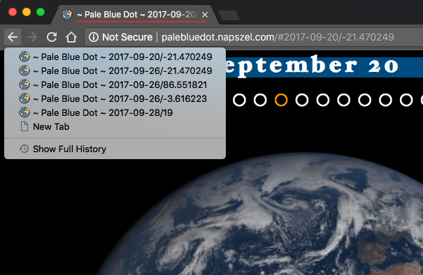

# Pale Blue Dot - a NASA Datanauts project
### Project website: [palebluedot.napszel.com](palebluedot.napszel.com)
contact: eva@napszel.com


_Look again at that dot. That's here. That's home. That's us. On it everyone you love, everyone you know, everyone you ever heard of, every human being who ever was, lived out their lives. ... -on a mote of dust suspended in a sunbeam._

-- Carl Sagan, Pale Blue Dot, 1994

### Being a NASA Datanaut

[NASA Datanauts](https://open.nasa.gov/explore/datanauts/) is a community of volunteer data scientists who work with [NASA's open data](https://open.nasa.gov/open-data/) to solve data challenges. Every half a year the Datanauts founding class welcomes 50 newcomers to join the community to advance their data science skills. Datanauts engage with each other and subject matter experts, listen to presentations, learn by completing challenges and work on their own projects.
 
I joined Datanauts as a member of the [2017 Spring Class](https://open.nasa.gov/explore/datanauts/2017/spring/). As my project I decided to work with the images taken by NASA's [Earth Polychromatic Imaging Camera](https://epic.gsfc.nasa.gov/epic) (EPIC).

This camera takes multiple colored images of the entire sunlit face of Earth every day. The spacecraft is located at the Earth-Sun Lagrange-1 (L-1) point giving EPIC a unique angular perspective. It has a field of view of 0.62 degrees, which is sufficient to image the entire Earth. Its distance from our planet, also allows it to captures Moon transits.

### The Pale Blue Dot project

The goal of [Pale Blue Dot](http://palebluedot.napszel.com) was to create a mobile compatible web page where the hundreds of images taken by EPIC can be viewed in an intuitive and enjoyable way. Which means that there is no user interface clutter (buttons not even needed to navigate), a very responsive experience (minimal waiting time if any) and showing the images almost full screen. This will hopefully ensure that rather than getting lost in the UI the users can submerge in the experience instead.


### JavaScript UX/UI
-------------------------------------

The first version of the project was pure Javascript that directly talked to NASA's servers. At this stage the focus was on perfecting the User Experience. Even though at first it sounds like a simple enough project, surprisingly many things had to be considered and implemented:
 
 1. **Navigation** - no buttons needed
 
 Instead of buttons and sliders you can scroll with your mouse (or touchpad) to go back in time and load older images. To rotate Earth you can naturally click and drag it. Similarly on mobile: use finger swipe up/down and left/right to change date and rotate Earth.
 
 Additionally, discrete UI buttons (dots and arrows) are also available for precise navigation.
 
    
 
 The UI allows both fast and slow navigation: a small scroll/swipe or arrow click changes the date just by one day. With a few fast scrolls/swipes you can easily go back to images of the past year. 
 
 To make sure that every user action has an instant feedback on the UI, a fast scroll will instantly update the date label to show the currently selected date. Even if the user has to wait a little for the images to load.
  
 2. **URL handling** - edit/share the links
 
 The Website's URL has the format _palebluedot.napszel.com/#2017-06-06/29_. That is: a hashmark followed by a date (separated by dashes) followed by a slash and a longitude number. Navigating to this URL will display an Earth image taken on 2017 June 6th showing Europe/Africa (longitude 29). You may copy-paste such paths for sharing.
 
 You are also free to edit the URLs to achieve fast and precise navigation. The application will search for the images taken on the supplied date (or if there are no images on that day then the closest earlier date when images were taken). Then it will search for the Earth rotation that is closest to the supplied longitude.
 
 You may also enter only a date (_palebluedot.napszel.com/#2017-12-19_) or only a longitude (_palebluedot.napszel.com/#29_). In that case the other will take a default value ('today' for date and '29' for longitude). If neither (_palebluedot.napszel.com_) or 'latest' (_palebluedot.napszel.com/#latest_) is given then both takes the default value which results in the latest image of Europe/Africa.
 
 3. **Updating the URL**
  
 As explained above, if the URL is edited the application catches this event and the UI is loaded accordingly. The opposite also had to be implemented: if the UI changes the fragment identifiers in the URL are edited by the application. 
 
 For example if the user navigates back one day from the latest images then the path will change from _palebluedot.napszel.com/#latest_ to _palebluedot.napszel.com/#2018-01-14/29_ in case this happened on Jan 16th. 
 
 Note that not every day has images. For example 2018 Jan 15th had none. Going back one day from Jan 16th will skip 15th and update the date on the UI and in the path to Jan 14th and load those images. Similarly, manually editing the path to _palebluedot.napszel.com/#2018-01-15/29_ will result in the same.
   
 4. **Browser's Back and Forward buttons**
 
 The application does not load different html resources when navigating on the UI. This means that the browser's Back and Forward buttons do nothing by default. For them to work, the application manually pushes addresses to the browser's history.
 
 For example, in case you go back one day in time, the application will edit the date part of the path and push it to history. Now if you click the browser's Back button, you are taken back to today.

 
 
  But not all navigation results in a path editing and history update. Consider the case where the user scrolls back 10 days very quickly with a mouse scroll or finger swipe. In this case if the path were edited to all dates during the scroll the browser's history would be polluted with day references which the user did not really have the time to look at (the images might have been not even loaded). To circumvent this, the path is only updated and pushed to history after you spend at least 500 ms viewing a day.
 
  
 5. **History** - updating the title of the page
 
 Browsers save your page visits in a list called history. If you check this list, you will see that it only shows the _title_ of each page you visited.
 
 In order to have meaningful history items for Pale Blue Dot the page's title is always edited according to the date/longitude selected. This way, instead of seeing ~ Pale Blue Dot ~, ~ Pale Blue Dot ~, ~ Pale Blue Dot ~ you see meaningful results.
 
 
  
 6. **Preserving selected longitude**
 
 Scrolling up and down between days preserves the longitude setting. This means that if you are viewing the European continent and then navigate to previous days, the application will always select the images closest to the European continent in previous days also. 
 
 But what if there are no close matches? For example on the day of the August 21st 2017 solar eclipse, multiple images were taken of the American continent to capture the event but none of Europe. If you are viewing an image of Europe from 22nd August and scroll to 21st of August the application will "jump" to the American continent. This is inevitable. However, if you continue going back one more day in August you will see Europe again.
  
 This is achieved by making sure that the longitude part of the URL is _not_ updated in case of date changes. The longitude number seen in the path is only a "goal" longitude. Meaning that the image shown by the app is always the closest image to that longitude but not necessarily the exact match. 
 
 Longitudes are only updated by the app in case the user _rotates_ the earth left or right with click and drag or finger swipe. After this event the longitude is updated in the path and becomes the new "goal" longitude.
 
 7. **CSS media query**
 
 Mobile screens are naturally smaller and required a slightly different UI arrangement to fit everything on screen. CSS media queries were used to change the layout for any screen below 670px.
 
  
 
 Since the threshold for "too small screen" is based on browser window size and not based on device type, the same rearranging of the UI happens on a regular desktop too if the browser window is shrunk. 
   
### Serving the assets
--------------------------

After the User Interface is ready and the navigation is intuitive, comes the question of _speed_. An interactive UI that is enjoyable responds to every user action within a second (if there is any way possible). Even if the implementation gives a simple way to change dates, if the new image takes 3-5 seconds to load, it will quickly board the user and hinder a positive experience. 

_Especially_, if the UI gives options to change views very quickly, the site has to be responsive. If the users were to change date with a date selector, they might be more forgiving in waiting time. However, one of goals of the project was to be able to enjoy these beautiful cloudy Earth images swirling, so waiting time was not something I wanted to compromise on.


1. **The NASA server's JSON files**

NASA stores these images on the server _epic.gsfc.nasa.gov_ which accepts requests through an open API. To find out the available images (names and many other information) for a given day, you can request a JSON file. This means you have to download one JSON file to show the images of one day. For example part of the JSON file for 2015-10-31:

```
[  
   {  
      "identifier":"20151031003633",
      "caption":"This image was taken by NASA's EPIC camera onboard the NOAA DSCOVR spacecraft",
    * "image":"epic_RGB_20151031003633",
      "version":"01",
      "centroid_coordinates":{  
         "lat":-5.102852,
         "lon":159.542508
      },
      "dscovr_j2000_position":{  
         "x":-1283061.502946,
         "y":-669893.465826,
         "z":-130240.863464
      },
      "lunar_j2000_position":{  
         "x":33466.895832,
         "y":354549.449169,
         "z":116876.96183
      },
      "sun_j2000_position":{  
         "x":-118557507.99999,
         "y":-82106194.000015,
         "z":-35593694.71975
      },
      "attitude_quaternions":{  
         "q0":-0.308502,
         "q1":-0.119342,
         "q2":0.210556,
         "q3":0.919914
      },
    * "date":"2015-10-31 00:31:45",
      "coords":{  
        "centroid_coordinates":{  
            "lat":-5.102852,
    *       "lon":159.542508
         },
         "dscovr_j2000_position":{  
            "x":-1283061.502946,
            "y":-669893.465826,
            "z":-130240.863464
         },
         "lunar_j2000_position":{  
            "x":33466.895832,
            "y":354549.449169,
            "z":116876.96183
         },
         "sun_j2000_position":{  
            "x":-118557507.99999,
            "y":-82106194.000015,
            "z":-35593694.71975
         },
         "attitude_quaternions":{  
            "q0":-0.308502,
            "q1":-0.119342,
            "q2":0.210556,
            "q3":0.919914
         }
      }
   },
   ...
]
```

This extract shows the information for _one image_ of the given date. The camera might take as many as 22 images per day. A full JSON file for such day is around 22 kilobytes which can take up to 1 second to download on fast internet and up to 3 seconds on slower one in Europe (results should be better closer to the server in USA and worse in Asia). And this is _only the JSON file_. We are not yet talking about downloading the images themselves.

2. **Serving the JSON files**

The JSON files provided by NASA contained too many unnecessary information for my project and is serviced too slow for the UX I had in mind. See in the previous file example - marked with asterisks - the 3 data that I actually need for one image: name, longitude and date. 

To improve on speed the JSON files were compacted and serviced from our own server. 

To shrink the JSON files the images are grouped together by date. This way only a list of name-longitude pairs are left. If the days are also grouped together in one singe JSON file we get this format:

```
[  
   {
      "d":"2015-10-12",
      "n":21,
      "i":[  
         "epic_1b_20151012000830",
         "epic_1b_20151012011358",
         "epic_1b_20151012032454",
         "epic_1b_20151012043021",
         "epic_1b_20151012053549",
         "epic_1b_20151012064118",
         "epic_1b_20151012074645",
         "epic_1b_20151012085213",
         "epic_1b_20151012095741",
         "epic_1b_20151012110308",
         "epic_1b_20151012120836",
         "epic_1b_20151012131404",
         "epic_1b_20151012141932",
         "epic_1b_20151012152459",
         "epic_1b_20151012163027",
         "epic_1b_20151012173555",
         "epic_1b_20151012184122",
         "epic_1b_20151012205219",
         "epic_1b_20151012215747",
         "epic_1b_20151012230314",
         "epic_1b_20151012021926"
      ],
      "l":[  
         166.151121,
         149.782218,
         117.048651,
         100.679819,
         84.31101,
         67.942223,
         51.577625,
         35.208885,
         18.840167,
         2.47147,
         -13.893037,
         -30.261688,
         -46.630318,
         -62.998926,
         -79.363345,
         -95.731908,
         -112.10045,
         -144.837471,
         -161.205948,
         -177.570236,
         133.41334
      ]
   },
   ...
]
```
 
This extract shows the information for _one day_ with 21 images. The rest of the days would follow after. So instead of having one JSON file for one day we have one JSON file for _all data_ (all days). Roughly storing the same amount of information for *one day as for one image* before.

To serve this JSON file from our server (an Amazon Web Services virtual machine) the following scripts were implemented:
 
 a. A [Bash script that downloads](../backend-scripts/download-recent-jsons.sh) recent JSON files from NASA server.
 b. A [Python script that sorts](../backend-scripts/fix-nasajson.py) each daily JSON file based on coordinates.
 c. A [Python script that concatenates](../backend-scripts/nasajsons-to-allnasa.py) the sorted daily JSON files into one single JSON file sorted by date (in the format shown above).
 d. A [Bash script that runs](../backend-scripts/daily.sh) all of the above in order.
 e. And finally a cronjob that runs the previous Bash script daily.
   
At the time of writing this document the full JSON file with all the days concatenated together from the beginning of EPIC's life is 418 kilobytes. This _single file_ is enough to be downloaded _once_ by the application - right at page load - and serves every later data request in an _instant_.

3. **Image sizes and download times**

The reformatting and serving of the JSON file improved on speed significantly but the huge size of the images were still making the UX too slow.

NASA gives options to download the images in 3 formats:

- png, 2048x2048 pixels, ~300Mb file size
- jpg, 1080x1080 pixels, ~180Kb file size
- jpg, 120x120 pixels, thumbnail

The thumbnails are obviously not big enough to shown in full screen. Out of the other two formats, even the smaller jpg format takes around 1.5 seconds to download for a user in Europe even on a gigabit internet. Partly because it is only serviced from one NASA server located in the USA and also because of their size. We are talking about _one_ image of a particular day.

A user from Europe will experience a minimum of 200 ms of delay just because of the distance from the NASA server. Because of the size of the images this goes up to 1.5 s in total download time. In the USA this should be around 1 s but even worse than 1.5 s in Asia.
 
One second might not sound like a long time but that is all it takes to have a sluggish user experience instead of an interactive UI.
 
4. **Serving the images - MaxCDN**

To solve the delay problem for users located far from the single NASA server a _Content Distribution Network_ (CDN) comes to mind. That is, a geographically distributed network of servers that store the NASA images and then services the requests spatially relative to users.

It is possible to buy such CDN services for a relatively small monthly fee. However, it was important to understand the different features they offer and picking the correct one for the project to actually makes the web app faster.

The most common feature a CDN service will offer is a so called _CDN pull zone_. This means they "pull" the static assets from your projects to cache it and serve it from their CDN Network. However, "pulling" only happens if an asset is requested by a user and the cache is cleared usually after 24 hours. This kind of CDN is useful for websites with many visits, requesting the same assets over and over again.

It is easy to see that for the images of the Pale Blue Dot project this would not be of much use. After a user loads the images of today, they have hundreds of other options for images they might want to load next. So it is very unlikely that even two users will request the same assets and so they would not see see any advantage of a pull zone.
 
What the Pale Blue Dot project needed was a much less common feature, called a _CDN push zone_. The only service found (middle of 2017) that offered this feature was [MaxCDN](https://www.maxcdn.com/). A MaxCDN push zone gives you the option to directly upload your files to a server which is then synced out to the distribution network. So even the first user gets serviced fast and the assets never get cleared like caches on a pull zone.

To serve the images from a MaxCDN push zone the following scripts were implemented and added to our own server (an Amazon Web Services virtual machine):

a. A [Bash script that downloads](../backend-scripts/download-images-for-day.sh) all new images daily.
b. A [Bash script that pushes](../backend-scripts/upload-day.sh) the images to MaxCDN.
c. A [Bash script that pushes](../backend-scripts/upload-allnasa.sh) our reformatted JSON file to MaxCDN.

Having the huge images and the optimized JSON file in a Content Distribution Network (updated and pushed every night) maximally optimized the download speed of assets, for every user, anywhere in the world. The download times of images went *below*  0.5 sec (for users with a gigabit internet) which gives a smooth user experience navigating between any of the Earth images. This would have been impossible with the NASA provided API.

###Image manipulation
------------------------

The user experience on a gigabit internet is flawless at this point with the minimized, single JSON file and assests distributed from a CDN. But of course not everybody has a gigabit internet. Even if you do, you might be travelling or on mobile data.

There is nothing really left to optimize on the server, it services the JSON file and images as fast as it is possible. The only thing left to improve is the size of the images it has to service.
 
1. **Individual thumbnails**

The idea is to show a smaller resolution version of the requested image in place of the real one until the full size image loads. 

The goal is to make these initial thumbnail images small enough that the application is able to instantly respond to user interaction with them (less than a second of download time) but also big enough that the user sees what they are looking at.

There are thumbnails provided by the NASA API but they are so small that they looked unacceptable when stretched to full screen.

This is an example of a NASA provided thumbnail stretched to 1024x1024 (5 KB):
 


However, with a little image conversion magic the Pale Blue Dot project generates their own thumbnails which are only 3 KBs more in size but looking much better in 1024x1024:

 

The download time for these thumbnails are 20 ms on a gigabit internet and 600 ms on 3G. The latter is already fast enough that it provides an acceptable user experience.

2. **Concatenated thumbnails**

But there is still in improvement that removes some of those 20-600ms waiting times.

The second improvement idea came from the assumption that once a user loaded a specific date they are likely to be interested in all or some of the other images of that day too. E.g. they will drag and rotate Earth around.

To make sure that Earth rotations cause absolute no delay, there is an additional image download that starts in the background when a user is spending time on a date: a concatenated image of all thumbnail images for one particular day. See example of this below.


This image is "cut and zoomed in" when the user rotates the Earth. This means that once this image is downloaded, the user is free to rotate Earth left and right with 0 delay and no network request.  

These concatenated thumbnails are around ~60KB depending on how many images were taken on that day. This takes 40 ms to download on gigabit internet and around 1.2 s on slow mobile internet.

To generate the thumbnails and concatenated images for each day the following scripts were implemented and added to our own server (an Amazon Web Services virtual machine):

a. A [Bash script that generates](../backend-scripts/resize-images-for-day.sh) the needed thumbnails.
b. A [magic script that concatenates] (../backend-scripts/concat.scans) the thumbnails.
c. A [Bash script that saves](../backend-scripts/save-images-for-day.sh) the images generated by the previous two scripts.
d. A [Bash script that runs](../backend-scripts/do-image-for-day.sh) all of the above in order.

2. **Big image**


3. **Parallel loading**

As hinted before, all image downloads happen in parallel. When a user stops on a particular image of a particular day the following image downloads start:

a. Small thumbnail of the image of date/longitude; ~8KB, ~20ms-600ms
b. Concatenated thumbnails of images of date; ~60KB, 40-1200ms
c. Full size version of the image of date/longitude; ?;? 

The user sees the small thumbnail first (a). As soon as the full size version of the same image is finished (c) it replaces the small resolution image. Meanwhile, the concatenated thumbnails also download (b). If the user now rotates Earth, there is no download time to show the new thumbnails.


4. **Cancelling of obsolete**
Also, full resolution images are loaded into the same object, which means that if you navigate away from a date before the image has been loaded the obsolete request is cancelled and the currently needed image's download is started instead.

This also means that loading a day from a year before takes the same amount of time as loading yesterday's images.
 
### Error reporting - TrackJS

### Performance reporting - TrakErr

### Future development
Better compact JSON

#### Feedback

eva@napszel.com

<script src="http://vjs.zencdn.net/4.0/video.js"></script>

<video id="pelican-installation" class="video-js vjs-default-skin" controls
preload="auto" width="683" height="384" poster="/static/screencasts/pelican-installation.png"
data-setup="{}">
<source src="video.mp4" type='video/mp4'>
</video>